# Eyves VM

> 多 Hypervisor 虚拟化管理面板 —— 对标 SolusVM（多虚拟化 + WHMCS 计费）与魔方云（企业级网络 + 快照备份）

Eyves VM 是从 [cub-panel](https://github.com/wd780h/cub-panel) 演进而来的下一代架构。cub-panel 已是一个可用的 Incus 自助面板，但在计费语义、多虚拟化后端、IPv6 网络、集群能力上存在结构性局限。本项目承载这些能力的**目标架构设计**与**首个领域模块（计费）的完整重构实现**。

---

## 项目状态（重要，请先读）

本仓库**不是**一个可直接运行的面板。`internal/billing` 是可编译、可测试的真实代码，其余六个模块目前只有设计态接口签名。

| 模块 | 状态 | 位置 | 说明 |
|---|---|---|---|
| 计费 billing | ✅ **已实现** | [internal/billing](internal/billing) | Money / Order 状态机 / Service，36 个测试函数 / 97 个用例，覆盖率 89.3%，零外部依赖 |
| 数据库迁移 | ✅ **已实现** | [migrations](migrations) | `0001` up/down + 10 项校验 + 备份回滚脚本 |
| API 规范 | ✅ **已定稿** | [api/openapi.yaml](api/openapi.yaml) | 31 路径 / 43 操作 / 36 schema，`$ref` 无悬空 |
| 架构设计 | 📐 设计态 | [docs/02-architecture.md](docs/02-architecture.md) | Mermaid 模块图 + 13 个 Go 接口定义 |
| Hypervisor 抽象层 | 📐 设计态 | docs/02 §2.3 | `Hypervisor` 接口 + Incus 适配器签名，**无实现** |
| 实例 instance | 📐 设计态 | docs/02 §2.3 | **无实现** |
| **镜像 image** | 📐 设计态 | [docs/02 §2.3.5](docs/02-architecture.md) | 三种来源（simplestreams / url / upload）+ 推拉分发 + 上游更新策略，**无实现** |
| 网络 network | 📐 设计态 | docs/02 §2.5 | IPv6 子网 / rDNS / 多网卡，**无实现** |
| 快照备份 snapshot | 📐 设计态 | docs/02 §2.3 | **无实现**。注意：cub-panel 已有用户自助快照（套餐配额 + 被控 API），Eyves VM 要加的是快照链、容量计量、定时备份与异地投递 |
| 集群 cluster | 📐 设计态 | docs/02 §2.6 | **无实现** |
| 套餐目录 catalog | 📐 设计态 | docs/02 §2.4 | **无实现** |
| Web UI / `cmd/` 入口 | ❌ 未开始 | — | 无 HTTP 路由、无模板、无 `main.go` |

因此：**不要尝试 `go build ./cmd/...`，目录不存在**。当前可执行的只有 `go test ./...`。

---

## 界面截图

> ⚠️ 下列截图取自**当前可运行的 cub-panel 代码库**（以 `-site "Eyves VM"` 启动，故界面标题显示 Eyves VM）。
> Eyves VM 自身的 Web UI **尚未实现**，这些图用于展示演进基线，不代表新架构已完成。

| 登录 | 注册 |
|---|---|
| 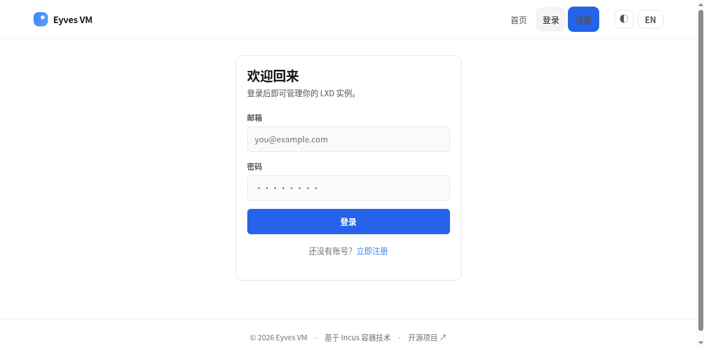 | 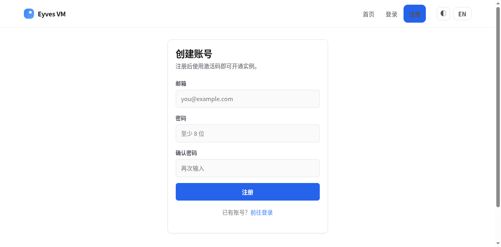 |

| 用户控制台 | 充值 |
|---|---|
| 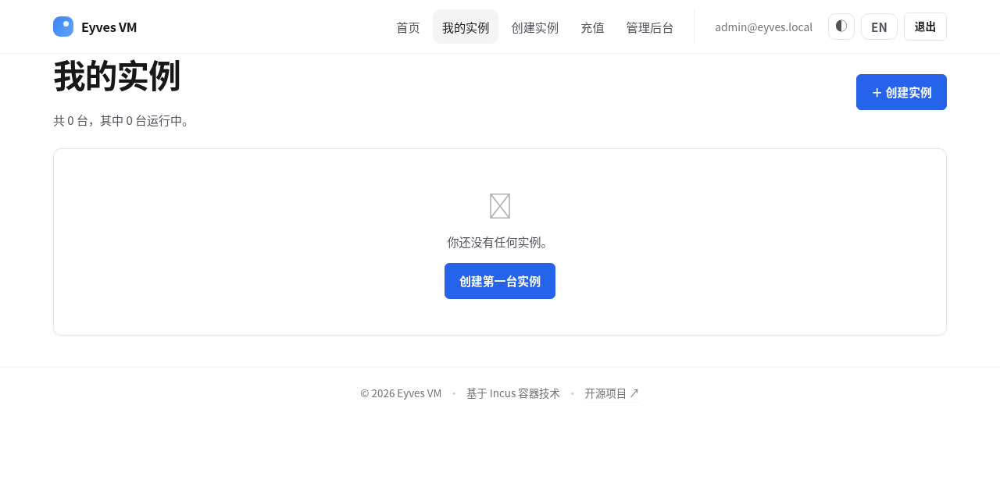 | 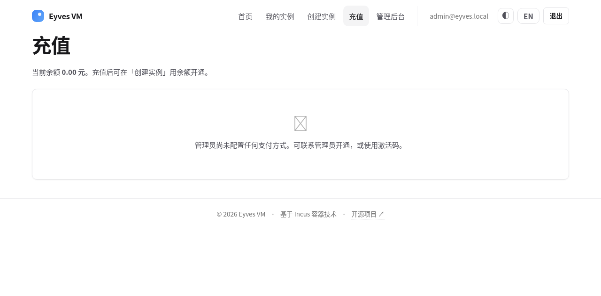 |

| 管理后台总览 | 节点管理 |
|---|---|
| 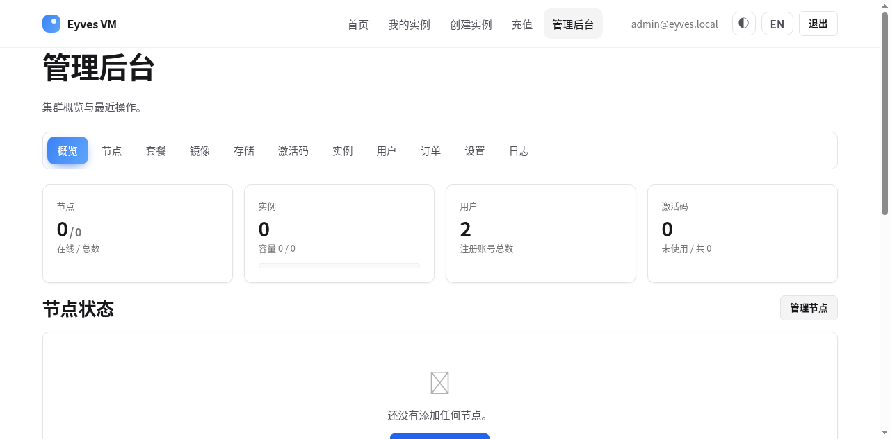 | 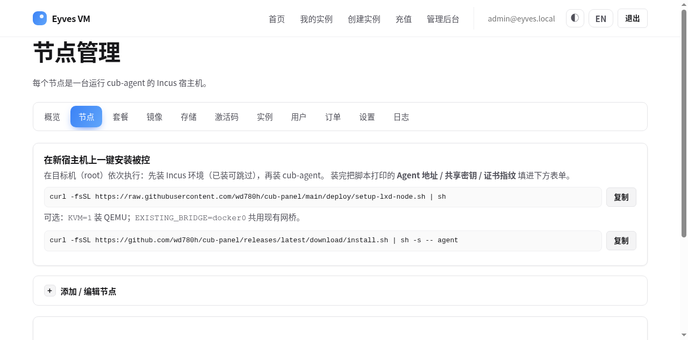 |

| 套餐管理 | 实例管理 |
|---|---|
| 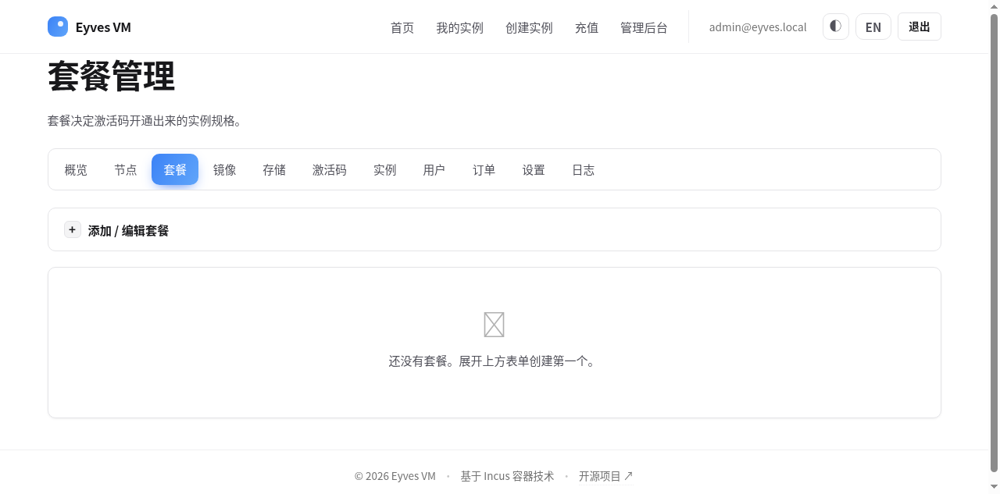 | 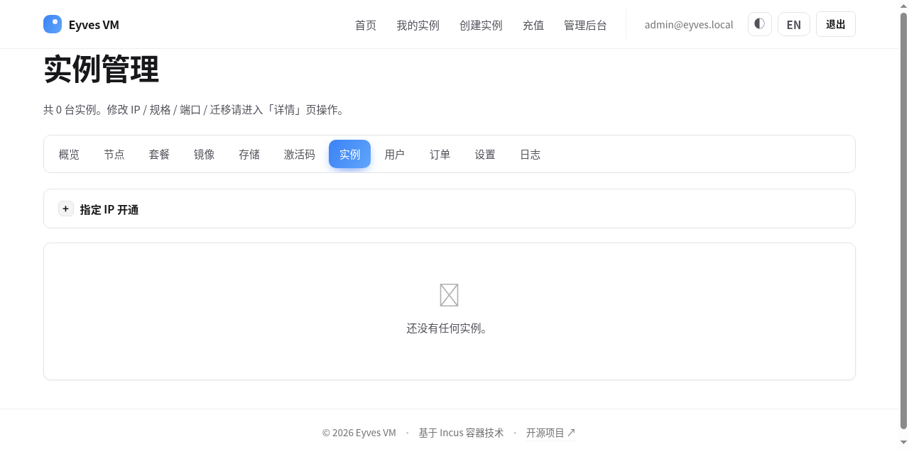 |

| 用户管理 | 订单管理 |
|---|---|
| 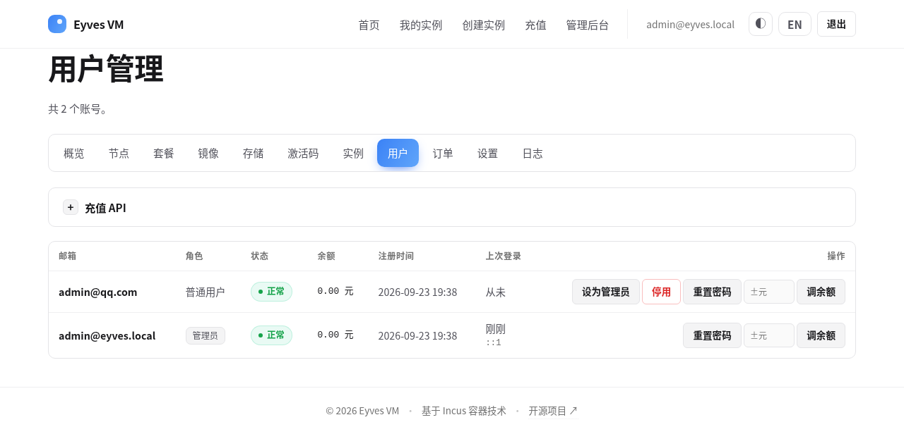 | 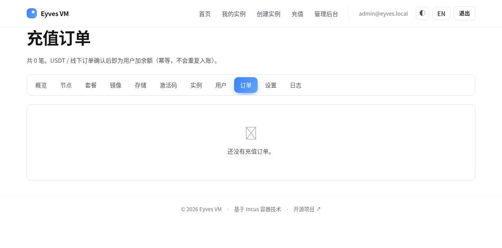 |

| 镜像管理 | 激活码 |
|---|---|
| 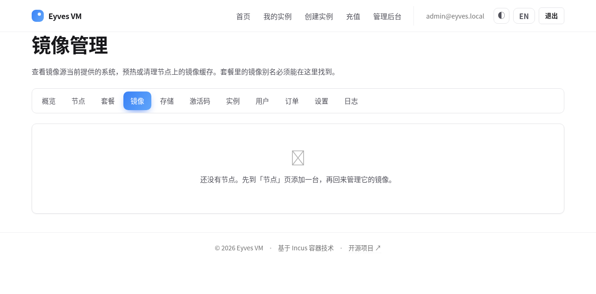 | 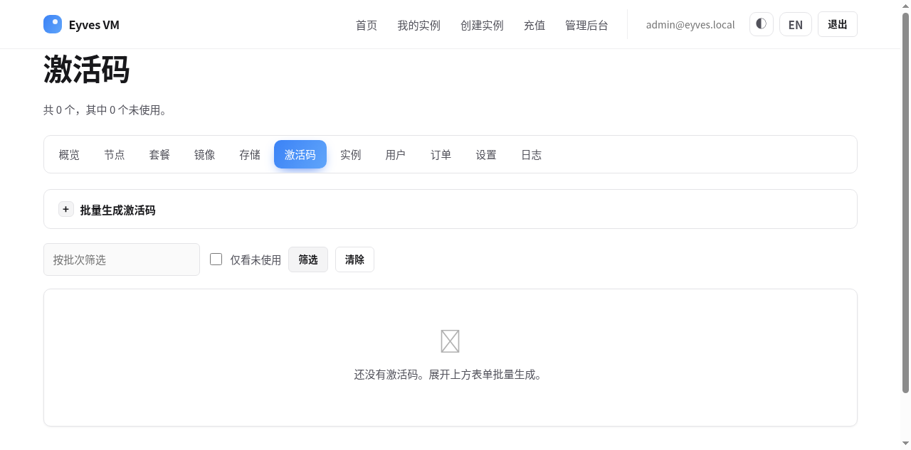 |

| 站点设置 | 存储管理 |
|---|---|
| 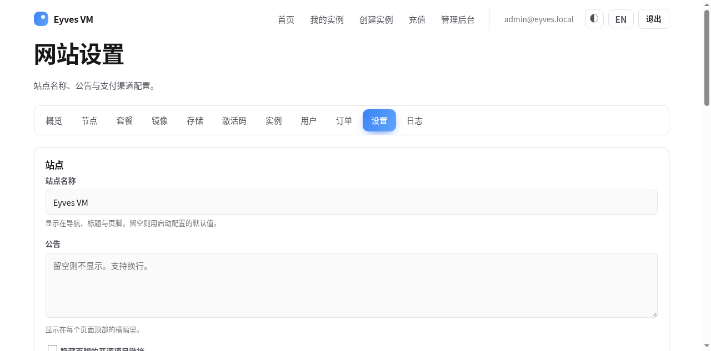 | 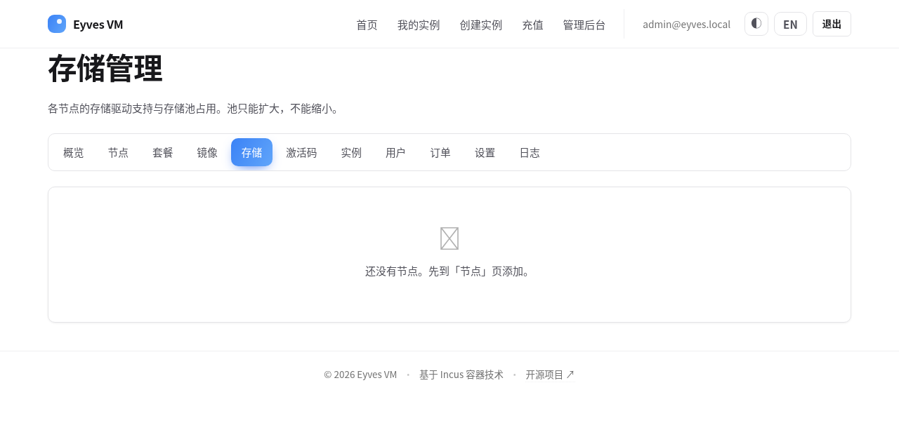 |

完整截图清单与采集说明见 [docs/screenshots/README.md](docs/screenshots/README.md)。

---

## 文档索引

| # | 文档 | 内容 |
|---|---|---|
| 01 | [坏味道扫描](docs/01-bad-smells.md) | cub-panel 全量扫描，10 类共 59 条，逐条附 `文件:行号` 与 P0/P1/P2 分级 |
| 02 | [目标架构](docs/02-architecture.md) | 硬约束与取舍、模块划分图、目录布局、模块职责与接口签名、计费详细设计、企业级网络、集群管理、被控端协议、CGO 构建约束 |
| 03 | [API 文档](docs/03-api.md) | 认证、错误信封、幂等约定、分页、全部端点速查、cURL 示例、旧接口兼容矩阵 |
| — | [OpenAPI 3.0](api/openapi.yaml) | 机器可读规范，可导入 Postman / Swagger UI |
| 04 | [数据迁移](docs/04-migration.md) | 字段映射表、未迁移字段声明、停机窗口 SOP、一条命令回滚 |
| 05 | [风险清单](docs/05-risks.md) | P0/P1/P2 分级，P0 均附回滚方案，P1 附验证用例 |
| 06 | [功能说明](docs/06-features.md) | 已实现 / 设计态 / 待开发三层功能矩阵，逐项标注可用性 |
| 07 | [代码审查自审](docs/07-self-review.md) | 以审查员身份逐条回答自审清单，列出 10 条仍存在的违规项 |
| 08 | [部署文档](docs/08-deployment.md) | 现状部署（cub-panel 双端）、systemd/OpenRC/Docker、配置项详解、升级回滚、排障 |

---

## 目录结构

```
eyves-vm/
├── api/
│   └── openapi.yaml              # OpenAPI 3.0.3 规范（/v2 前缀）
├── docs/
│   ├── 01-bad-smells.md          # 坏味道扫描
│   ├── 02-architecture.md        # 目标架构
│   ├── 03-api.md                 # API 文档（人读版）
│   ├── 04-migration.md           # 数据迁移方案
│   ├── 05-risks.md               # 风险清单与回滚
│   ├── 06-features.md            # 功能说明
│   ├── 07-self-review.md         # 代码审查自审
│   ├── 08-deployment.md          # 部署文档
│   └── screenshots/              # 界面截图
├── internal/
│   └── billing/                  # 计费域（唯一已实现模块）
│       ├── errors.go             # 结构化错误码 EYVES-XXX
│       ├── money.go              # 金额类型（整数分，杜绝浮点误差）
│       ├── order.go              # 订单实体 + 状态机
│       ├── service.go            # 购买/续费/退款编排
│       └── *_test.go             # 5 个测试文件
├── migrations/
│   ├── 0001_billing_orders.up.sql
│   ├── 0001_billing_orders.down.sql
│   ├── verify.sql                # 10 项一致性校验
│   ├── migrate-up.sh             # 备份 + 迁移 + 校验
│   └── rollback.sh               # 一条命令回滚
├── config.example.yaml           # 配置样例（Env 前缀 EYVES_）
├── go.mod                        # 零外部依赖
└── README.md
```

目标布局（尚未落地）见 [docs/02-architecture.md §2.2](docs/02-architecture.md)。

---

## 快速开始

### 环境要求

- Go **1.25+**
- 无需 CGO、无需数据库、无需外部依赖

### 运行测试

```bash
git clone https://github.com/FenhaoLost/eyves-vm.git
cd eyves-vm

go vet ./...
go test -race -cover ./...
```

预期输出：

```
ok  	eyves/internal/billing	0.005s	coverage: 89.3% of statements
```

### 查看 API 规范

```bash
# 导入 Swagger Editor / Postman / Apifox
cat api/openapi.yaml

# 或用 npx 起本地预览
npx @redocly/cli preview-docs api/openapi.yaml
```

### 校验 OpenAPI 是否自洽

```bash
npx @redocly/cli lint api/openapi.yaml
```

---

## 核心设计约束

这些约束是硬性的，任何变更都需要显式评审：

| 约束 | 内容 | 依据 |
|---|---|---|
| 纯静态二进制 | `CGO_ENABLED=0`，不引入 glibc 依赖 | docs/02 §2.0 |
| 数据库 | 单机 SQLite 单文件；预留 PostgreSQL 集群扩展接口 | docs/02 §2.0 |
| 被控协议冻结 | 主控 ↔ cub-agent 的 HTTPS + HMAC 签名协议保持不变 | docs/02 §2.7 |
| Hypervisor | 必须支持 Incus（现有）、KVM（libvirt 直连）、OpenVZ（预留） | docs/02 §2.3 |
| 项目布局 | `cmd/ internal/ pkg/ api/ migrations/ docs/` | docs/02 §2.2 |
| API 兼容 | 新接口一律 `/v2/` 前缀；旧 `/app/*`、`/api/*`、`/admin/*` 原样保留 | api/openapi.yaml |
| 依赖策略 | 零外部依赖；引入须记录用途/替代方案/维护状态/License | go.mod 注释 |

---

## 计费模块亮点

`internal/billing` 是本次交付的示范模块，解决了 cub-panel 在资金路径上的几个 P0 缺陷（详见 [docs/01-bad-smells.md](docs/01-bad-smells.md) 与 [docs/05-risks.md](docs/05-risks.md)）：

| 问题（cub-panel） | 解法（Eyves VM） |
|---|---|
| 金额用浮点/字符串，存在精度误差 | `Money` 类型：`int64` 最小单位 + 币种校验，跨币种运算直接报错 |
| 订单只有"充值"一种语义 | 统一 `Order` 模型，`kind ∈ {recharge, purchase, renew, upgrade, refund}` |
| 状态靠裸字符串散落各处 | 显式状态机，非法迁移返回 `EYVES-303` |
| 下发失败后资金滞留 | 购买流程锁定"扣款成功则必退"，失败自动全额退款 |
| 重复回调导致重复入账 | 全链路幂等键 `ref`，重放返回既有资源并标 `duplicated=true` |
| 退款无部分退款能力 | 支持部分退款，`refunded_cents` 累加，状态迁移到 `partially_refunded` |
| 错误靠字符串比较 | 结构化错误码 `EYVES-XXX`，配合 `errors.Is/As` |

> 已知边界：SQLite 适配器**尚未实现**，89.3% 是领域层覆盖率，SQL 路径覆盖率为 0。详见 [docs/07-self-review.md §7.3](docs/07-self-review.md)。

---

## 与 cub-panel 的关系

```
cub-panel (Go 1.25, 主控 + 被控, SQLite)     ← 当前可运行，已部署
    │
    │  坏味道扫描 → 架构重设计 → 领域模块重构
    ▼
eyves-vm (本仓库)                            ← 设计态 + 计费模块
    │
    │  待补齐：cmd/ 入口、存储适配器、Web 层、其余六个模块
    ▼
Eyves VM 正式版                              ← 目标
```

被控端 `cub-agent`（约 7.4 MB，仅与本机 Incus Unix Socket 通信）在 Eyves VM 中**继续复用**，协议不变。

---

## 安全提示

- 仓库内**不含**任何密钥、证书、数据库文件或构建产物（见 `.gitignore`）
- 所有敏感配置必须通过环境变量注入，禁止写入 `config.yaml`：`EYVES_NETWORK_RDNS_TSIG_SECRET`、`EYVES_PAYMENT_EPAY_KEY`、节点 HMAC 密钥（存于 `nodes.secret`）
- 生产环境务必开启 `panel.secure_cookies`，并确保 `panel.trust_proxy` 仅在受信反向代理之后启用

---

## 参与贡献

1. 阅读 [docs/02-architecture.md](docs/02-architecture.md) 了解设计约束
2. 阅读 [docs/07-self-review.md §7.3](docs/07-self-review.md) 了解当前待修复违规项
3. 提交前必须通过：`go vet ./... && go test -race -cover ./...`，新增代码覆盖率不得低于 80%
4. 数据库变更必须同时提供 `up` 与 `down` 迁移脚本

---

## 许可

尚未确定（仓库当前无 LICENSE 文件）。在明确之前，默认保留所有权利。