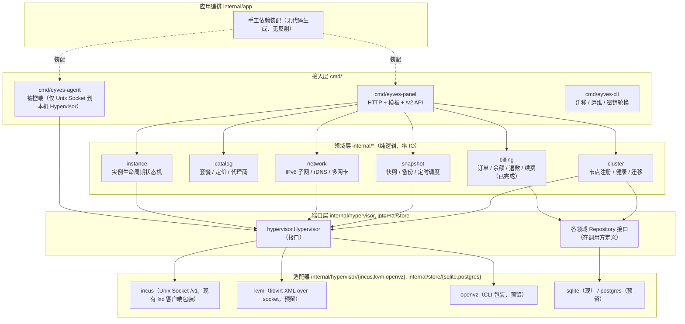
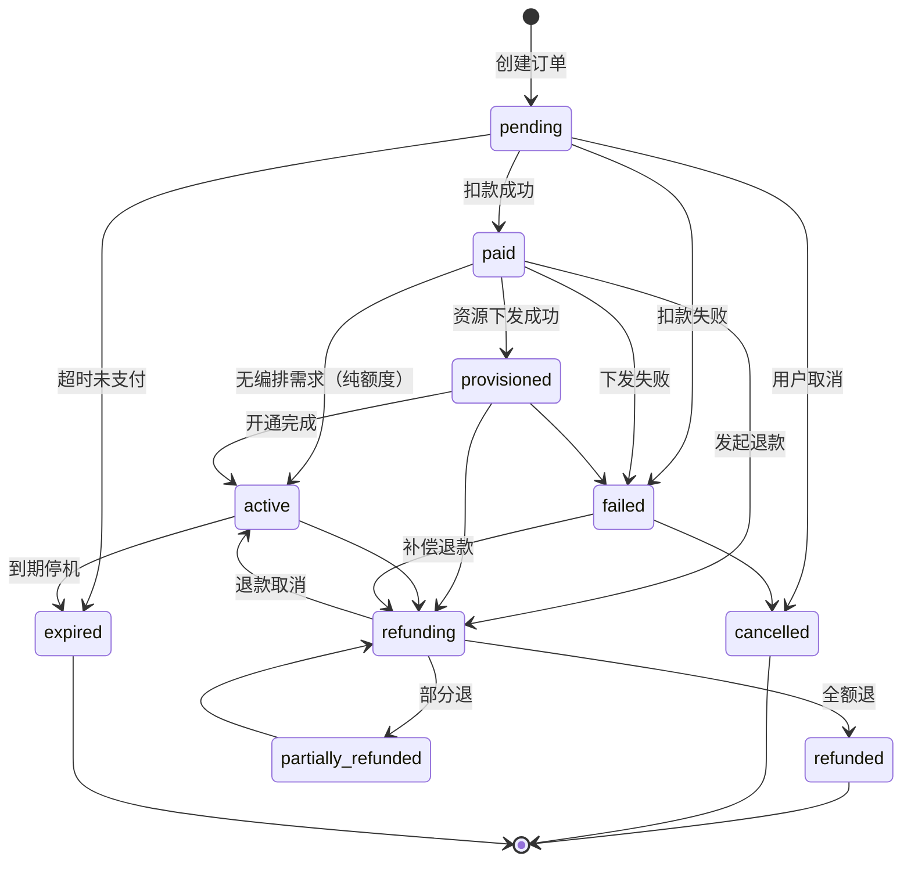
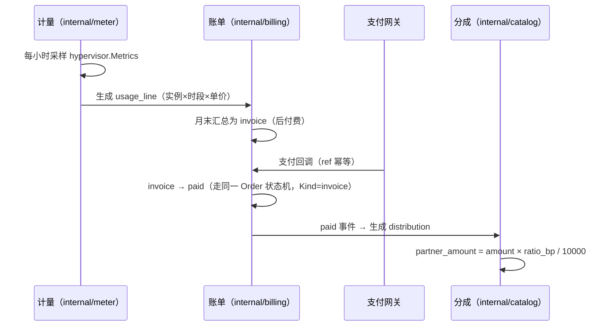
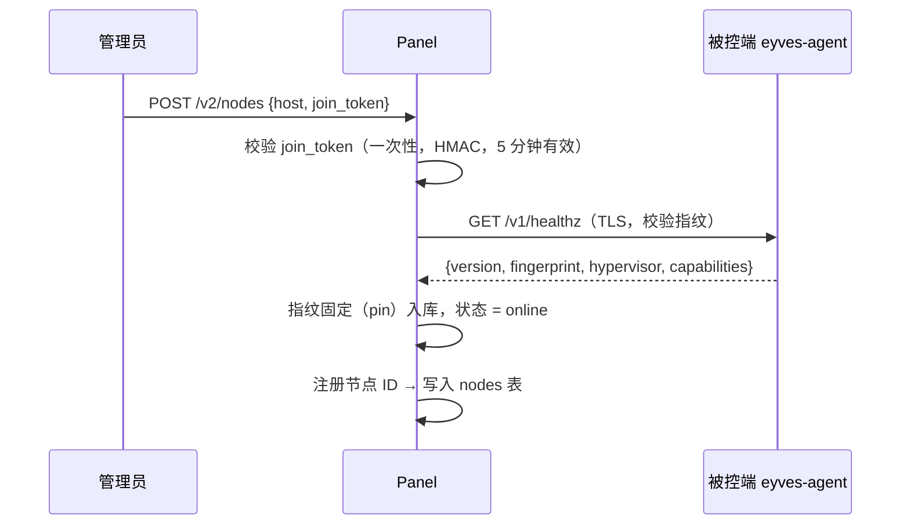
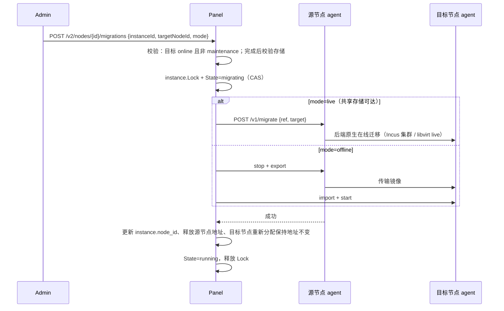

# 第二部分：Eyves VM 目标架构

## 2.0 硬约束与取舍

| 约束 | 落地手段 | 不做的事 |
|---|---|---|
| Go 纯静态二进制（`CGO_ENABLED=0`） | 只用标准库 + 纯 Go 驱动（`modernc.org/sqlite`）；`go build` 由 CI 断言 `CGO_ENABLED=0` | 不引入需要 cgo 的 `mattn/go-sqlite3`、不引入 `libvirt` cgo binding（KVM 走 `libvirt-go-xml` + TCP/Unix socket 协议） |
| SQLite 单文件（单机），预留 PostgreSQL 集群 | 仓储层全部走 `?` 占位 + `Dialect.Rebind()`；**迁移脚本按方言各写一份**（吸取 S9-1 的 `strings.ReplaceAll` 教训） | 不做运行期 SQL 文本改写 |
| 被控端协议不变（HTTPS + HMAC） | `internal/agentapi` 冻结现有 `shared/proto.go` 的签名/时间窗/特性位语义，仅新增字段（向后兼容的 additive change） | 不改签名算法、不改路径、不改请求体必填项 |
| 多 Hypervisor：Incus（现有）/ KVM（libvirt）/ OpenVZ（预留） | `internal/hypervisor` 接口 + 各后端适配器；面板与计费层只依赖接口 | 不在业务层出现 `*lxd.Client`（消除 S8-1） |

## 2.1 模块划分图



**依赖方向铁律**：`cmd → app → domain → port ← adapter`。适配器只被 `app` 装配，**domain 永不 import 适配器**。

## 2.2 目录布局（Go 官方布局）

```text
eyves-vm/
├── cmd/
│   ├── eyves-panel/main.go      # 主控入口：读配置 → 装配 → 启动 + 优雅退出
│   ├── eyves-agent/main.go      # 被控入口：仅监听本机，Unix Socket 调 Hypervisor
│   └── eyves-cli/main.go        # migrate / verify / rotate-key / backup
├── internal/
│   ├── app/            # 装配 + 生命周期（唯一知道所有具体类型的地方）
│   ├── billing/        # ✅ 已完成：Money / Order / Service / errors
│   ├── catalog/        # 套餐、定价、促销、代理商分成
│   ├── instance/       # 实例生命周期（状态机 + 动作编排）
│   ├── network/        # IPv6 子网分配、rDNS、多网卡
│   ├── snapshot/       # 快照 / 备份 / 定时任务
│   ├── cluster/        # 节点注册、健康检查、跨节点迁移
│   ├── hypervisor/     # 抽象接口 + 能力探测
│   │   ├── incus/
│   │   ├── kvm/
│   │   └── openvz/
│   ├── agentapi/       # 被控端协议（HTTPS + HMAC，冻结语义）
│   ├── store/          # 仓储实现（sqlite 现 / postgres 预留）
│   ├── config/         # config.yaml + EYVES_* 环境变量覆盖
│   ├── errs/           # EYVES-XXX 结构化错误（billing 已用，余者复用）
│   └── obs/slog.go     # 日志/指标/trace_id
├── pkg/                # 仅放"可被外部引用且无需内部上下文"的包。
│                       # 当前**为空**（`internal/billing` 的 Money 尚未证明需要被外部引用，
│                       # 提前下沉会过早固化 API）；出现真实外部需求时再创建，禁止预建空目录。
├── api/
│   ├── openapi.yaml    # ✅ 已完成（982 行）
│   └── v2/             # /v2 路由挂载 + 请求/响应 DTO 映射
├── migrations/         # ✅ 0001 已完成：up / down / verify / migrate-up.sh / rollback.sh
├── configs/config.example.yaml   # ✅ 已完成
└── docs/
```

## 2.3 各模块职责 · 依赖 · 对外接口

### 2.3.1 `internal/hypervisor`（多 Hypervisor 抽象层，消除 S8-1）

职责：把「一台宿主机上的虚拟化后端」抽象为统一操作集；**能力差异显式化**，不支持的操作用 `Capabilities` 声明并由上层降级，而不是靠 `if node.isVm()` 散落判断。

```go
package hypervisor

import (
	"context"
	"io"
	"time"
)

// Kind 是后端类型。
type Kind string

const (
	KindIncus  Kind = "incus"  // 现有，容器/虚拟机
	KindKVM    Kind = "kvm"    // 预留：libvirt
	KindOpenVZ Kind = "openvz" // 预留
)

// GuestState 是后端无关的实例状态。旧代码直接比较 LXD 字符串
// （"Running"/"Stopped"）导致状态语义泄漏，此处统一闭集。
type GuestState string

const (
	StateRunning     GuestState = "running"
	StateStopped     GuestState = "stopped"
	StateStarting    GuestState = "starting"
	StateStopping    GuestState = "stopping"
	StateMigrating   GuestState = "migrating"
	StateUnknown     GuestState = "unknown"
)

// Feature 是可选能力位，字面量与 shared/proto.go 的 AllowedFeatures 对齐（协议不变）。
type Feature string

const (
	FeatureSnapshot  Feature = "snapshot"
	FeatureISO       Feature = "iso"        // 仅 KVM/VM
	FeatureConsole   Feature = "console"
	FeatureResize    Feature = "resize"
	FeatureMigration Feature = "migration"
	FeatureIPv6      Feature = "ipv6"
)

// Capabilities 声明后端支持的能力与上限，供上层降级与前端置灰。
type Capabilities struct {
	Kind            Kind
	Features        map[Feature]bool
	MaxCPU          int   // 0 表示不限
	MaxMemoryBytes  int64 // 0 表示不限
	MaxDiskBytes    int64 // 0 表示不限
	SupportsLiveMigrate bool
}

// Spec 是创建/重建实例的完整规格（后端无关）。
type Spec struct {
	Name      string
	Image     string // 镜像别名或指纹
	CPU       int
	MemoryMB  int
	DiskGB    int
	IsVM      bool     // Incus 区分容器/虚拟机；KVM 恒为 true
	Networks  []NICSpec
	UserData  string   // cloud-init，后端不支持时忽略
	Features  []Feature // 需要开通的可选特性，必须在 Capabilities 内
}

// NICSpec 是一块网卡的声明（见 2.5 多网卡）。
type NICSpec struct {
	Ordinal    int    // 网卡序号，0 起
	Bridge     string // 宿主网桥
	MAC        string // 空则由后端生成
	IPv6       string // 单地址或 CIDR，空表示仅 L2
	RateDownMbps int
	RateUpMbps   int
}

// Guest 是后端返回的实例快照（只读读模型）。
type Guest struct {
	Ref       string // 后端侧标识（Incus 的实例名）
	Name      string
	State     GuestState
	CPU       int
	MemoryMB  int
	DiskGB    int
	Addresses []string
	CreatedAt time.Time
}

// Metrics 是实例运行指标。
type Metrics struct {
	CPUSeconds      float64
	MemoryBytes     int64
	DiskReadBytes   int64
	DiskWriteBytes  int64
	NetRxBytes      int64
	NetTxBytes      int64
	SampledAt       time.Time
}

// Snapshot 是后端侧快照元数据。
type Snapshot struct {
	Name      string
	CreatedAt time.Time
	SizeBytes int64
}

// ConsoleOptions 描述交互式控制台。
type ConsoleOptions struct {
	Shell  []string // 空则后端默认
	Width  int
	Height int
}

// Console 是一个双向控制台通道，调用方负责 Close。
type Console interface {
	io.ReadWriteCloser
	Resize(width, height int) error
}

// Hypervisor 是唯一的虚拟化后端契约。实现方（incus/kvm/openvz）
// 必须在并发下安全；单实例操作由实现内部串行化。
type Hypervisor interface {
	// Kind 报告后端类型。
	Kind() Kind
	// Capabilities 报告能力位；面板据此降级而非报错。
	Capabilities(ctx context.Context) (Capabilities, error)

	// --- 生命周期 ---
	Create(ctx context.Context, spec Spec) (Guest, error)
	Start(ctx context.Context, ref string) error
	Stop(ctx context.Context, ref string, force bool) error
	Restart(ctx context.Context, ref string, force bool) error
	Delete(ctx context.Context, ref string) error
	Status(ctx context.Context, ref string) (Guest, error)
	List(ctx context.Context) ([]Guest, error)

	// --- 规格变更 ---
	Resize(ctx context.Context, ref string, spec Spec) error
	Reinstall(ctx context.Context, ref, image string) error
	// EnterRescue 进入救援模式（挂载救援镜像），KVM 专有；不支持时返回 ErrUnsupported。
	EnterRescue(ctx context.Context, ref string) error
	ExitRescue(ctx context.Context, ref string) error

	// --- 媒体 ---
	AttachISO(ctx context.Context, ref, isoPath string) error
	DetachISO(ctx context.Context, ref string) error

	// --- 快照 ---
	CreateSnapshot(ctx context.Context, ref, name string) (Snapshot, error)
	ListSnapshots(ctx context.Context, ref string) ([]Snapshot, error)
	RestoreSnapshot(ctx context.Context, ref, name string) error
	DeleteSnapshot(ctx context.Context, ref, name string) error

	// --- 网络 ---
	// SetNICs 幂等地把实例网卡收敛到 specs（增/改/删）。
	SetNICs(ctx context.Context, ref string, specs []NICSpec) error

	// --- 迁移 ---
	// Migrate 把实例迁到 target。requiresSharedStorage 时实现方必须校验存储可达。
	Migrate(ctx context.Context, ref string, target MigrateTarget) error

	// --- 观测 ---
	Metrics(ctx context.Context, ref string) (Metrics, error)
	Console(ctx context.Context, ref string, opts ConsoleOptions) (Console, error)

	// --- 地址分配（IPv6 已在 Panel 侧规划，此处只做落地） ---
	AssignAddresses(ctx context.Context, ref string, ordinals []int, addrs []string) error
}

// MigrateTarget 描述迁移目的节点（含校验材料，防止迁到不可达存储）。
type MigrateTarget struct {
	NodeID              int64
	AgentEndpoint       string
	RequiresSharedStorage bool
}
```

错误契约（`internal/hypervisor/errors.go`）：

```go
package hypervisor

import "errors"

var (
	// ErrUnsupported 表示当前后端不支持该操作；上层应降级而非 500。
	ErrUnsupported = errors.New("hypervisor: operation unsupported by backend")
	// ErrGuestNotFound 表示实例不存在；上层应据此修正本地状态而不是重试。
	ErrGuestNotFound = errors.New("hypervisor: guest not found")
	// ErrAlreadyExists 表示实例名/别名冲突。
	ErrAlreadyExists = errors.New("hypervisor: guest already exists")
	// ErrBusy 表示实例正忙（迁移中/操作进行中），上层应退避重试。
	ErrBusy = errors.New("hypervisor: guest busy")
)
```

### 2.3.2 Incus 适配器（改写现有 `internal/lxd`）

```go
package incus

import (
	"context"

	"eyves/internal/hypervisor"
)

// Client 是本机 Incus 的 Unix Socket 客户端（由现有 internal/lxd 客户端包装而来）。
// 只对 hypervisor.Hypervisor 负责，不再向业务层暴露 *lxd.Client。
type Client struct {
	socket   string        // 默认 /var/lib/incus/unix.socket（来自 config.yaml，禁止硬编码，消除 S4-5）
	pool     string        // 存储池
	http     *http.Client  // 由装配注入，支持按节点超时/测试替换（消除 S7-5）
}

// New 由 internal/app 装配；返回具体类型，满足《规范·结构：实现方返回具体类型》。
func New(cfg Config) (*Client, error)

// 编译期断言：Incus 必须完整实现契约。
var _ hypervisor.Hypervisor = (*Client)(nil)

// Capabilities 返回 Incus 的能力位：
//   snapshot/console/resize/ipv6 = true；iso 仅在 IsVM 时可用（由 Spec 决定）；
//   migration = 集群共享存储可达时为 true。
func (c *Client) Capabilities(ctx context.Context) (hypervisor.Capabilities, error)

// Create 把 hypervisor.Spec 映射为 Incus 线格式（旧 validateCreate 的 99 行逻辑
// 拆为：validateSpec → buildDevices → postInstances → waitNetwork，各自 ≤30 行）。
func (c *Client) Create(ctx context.Context, spec hypervisor.Spec) (hypervisor.Guest, error)

// EnterRescue / ExitRescue：容器形态返回 hypervisor.ErrUnsupported（Incus 容器无救援镜像）。
func (c *Client) EnterRescue(ctx context.Context, ref string) error
```

KVM 与 OpenVZ 适配器**只写接口桩 + 能力矩阵**，`New` 返回 `ErrUnsupported`，避免 YAGNI：

```go
package kvm

// New 在未启用时返回 hypervisor.ErrUnsupported。
// 启用条件：config.yaml 的 hypervisor.kvm.enabled = true 且 libvirt socket 可达。
// 说明：libvirt 交互使用官方 XML 结构体（github.com/libvirt/libvirt-go-xml，纯 Go，
// 无 cgo），通过 Unix Socket 直连，不引入 libvirt C 绑定。
```

### 2.3.3 `internal/instance`（生命周期）

职责：唯一可以推进实例状态的模块；所有状态写入走状态机，杜绝 S10-3 的"无条件覆盖 status"。

```go
package instance

import (
	"context"
	"time"

	"eyves/internal/hypervisor"
)

// State 是面板侧实例状态（与后端状态分离：面板状态含计费语义如 expired）。
type State string

const (
	StateProvisioning State = "provisioning"
	StateRunning      State = "running"
	StateStopped      State = "stopped"
	StateSuspended    State = "suspended"   // 欠费/超流量
	StateExpired      State = "expired"
	StateRescuing     State = "rescuing"
	StateMigrating    State = "migrating"
	StateError        State = "error"
	StateDeleted      State = "deleted"
)

// Action 是用户/系统可发起的动作。
type Action string

const (
	ActionStart     Action = "start"
	ActionStop      Action = "stop"
	ActionRestart   Action = "restart"
	ActionReinstall Action = "reinstall"
	ActionRescue    Action = "rescue"
	ActionDelete    Action = "delete"
	ActionMigrate   Action = "migrate"
)

// Lock 是实例级互斥端口，消除 S10-1（两个 job 并发 stop 同一实例）。
// 实现建议：DB 行锁 + 进程内 per-id mutex 的本地缓存；跨节点由 DB 行锁裁决。
type Lock interface {
	// Acquire 获取实例锁；已被占用时返回 ErrBusy，调用方退避而非阻塞。
	Acquire(ctx context.Context, instanceID int64) (release func(), err error)
}

// Instance 是实例读模型。
type Instance struct {
	ID        int64
	UserID    int64
	NodeID    int64
	Name      string
	Ref       string          // Hypervisor 侧标识
	State     State
	Spec      hypervisor.Spec
	DueAt     time.Time       // 计费到期时间（与订阅一致）
	CreatedAt time.Time
}

// Repo 是实例持久化端口（在调用方定义）。
type Repo interface {
	ByID(ctx context.Context, id int64) (*Instance, error)
	Save(ctx context.Context, in *Instance) error
	SaveIfState(ctx context.Context, in *Instance, expected State) error // CAS，消除 S10-3
}

// Nodes 是节点解析端口。
type Nodes interface {
	HypervisorFor(ctx context.Context, nodeID int64) (hypervisor.Hypervisor, error)
}

// Service 编排实例动作。所有变更动作必须持 Lock。
type Service struct {
	repo   Repo
	nodes  Nodes
	lock   Lock
	clock  func() time.Time
}

// Apply 执行一个动作：校验状态机 → 加锁 → 调 Hypervisor → CAS 回写状态。
func (s *Service) Apply(ctx context.Context, instanceID int64, act Action, opts ActionOptions) (*Instance, error)
```

### 2.3.4 `internal/catalog`（套餐与定价）

```go
package catalog

import (
	"context"
	"time"
)

// Cycle 是计费周期。
type Cycle string

const (
	CycleHourly  Cycle = "hourly"  // 按量（后付费）
	CycleMonthly Cycle = "monthly"
	CycleQuarterly Cycle = "quarterly"
	CycleYearly  Cycle = "yearly"
)

// Plan 是套餐（资源规格 + 定价 + 可见性/代理商归属）。
type Plan struct {
	ID        int64
	Code      string
	GroupID   int64  // 套餐分组；代理商只能见自己组（对标魔方云的"代理商套餐"）
	CPU       int
	MemoryMB  int
	DiskGB    int
	TrafficGB int
	IPv6Count int
	SnapshotQuota int
	Features  []string
	// Prices 支持多周期多币种（旧库 plans 只有单一 price_cents，无法做年付折扣）。
	Prices    []Price
	// RefundPolicy 定义退款规则，供 billing.Service 计算退款上限。
	RefundPolicy RefundPolicy
	Active    bool
}

// Price 是一个「周期 × 币种」的定价。
type Price struct {
	Cycle    Cycle
	Currency string // 与 billing.Currency 对齐
	AmountMinor int64
	SetupMinor  int64
	// PartnerRatioBP 是代理商分成比例（基点，万分之一），0 表示跟随全局默认。
	PartnerRatioBP int
}

// RefundPolicy 是套餐退款策略。
type RefundPolicy struct {
	// WindowDays 为可退款窗口（天）；0 表示按服务期。
	WindowDays int
	// DaysConsumedRefundable 为已消费天数是否可退。
	DaysConsumedRefundable bool
	// RestockRatioBP 是退还比例（基点）。例如 7000 = 退 70%。
	RestockRatioBP int
}

// Repo 是套餐仓储端口。
type Repo interface {
	ByID(ctx context.Context, id int64) (*Plan, error)
	ByCode(ctx context.Context, code string) (*Plan, error)
	List(ctx context.Context, filter ListFilter) ([]*Plan, error)
	PriceOf(ctx context.Context, planID int64, cycle Cycle, currency string) (Price, error)
	Save(ctx context.Context, p *Plan) error
}

// ListFilter 是套餐列表过滤条件（导出用，避免上层拼 SQL）。
type ListFilter struct {
	GroupIDs []int64
	Active   *bool
	Currency string
	Cycle    Cycle
	Limit    int
	Offset   int
}
```

`catalog` 只负责**定价查询**；扣款与订单由 `billing` 负责。二者通过 `Plan.Price` 在 `internal/app` 装配处对接，避免双向依赖。

### 2.3.5 `internal/errs`（结构化错误，全站统一）

分段规则以**已实现**的 [errors.go](file:///workspace/eyves-vm/internal/billing/errors.go#L25-L43) 为唯一事实来源，其余域按同一分段扩展：

| 段位 | 归属 | 已实现 / 预留 |
|---|---|---|
| `EYVES-1xx` | 计费入参与金额校验（已实现） | `101` 金额非法、`102` 金额越界、`103` 需正数、`104` 币种不一致、`105` 未知币种 |
| `EYVES-2xx` | 余额与账本（已实现） | `201` 余额不足、`202` 幂等 ref 重复、`203` 账户不存在 |
| `EYVES-3xx` | 订单与状态机（已实现） | `301` 订单不存在、`302` 非法流转、`303` 不可退款、`304` 超出退款时限（已定义，待 Renew/Upgrade 联调时启用） |
| `EYVES-4xx` | 外部依赖编排（已实现） | `401` 编排失败、`402` 领域入参缺失 |
| `EYVES-0xx` / `5xx` / `6xx` | 基础设施 / 集群 / 网络（预留下沉到 `internal/errs`） | 本文件为规划值，**尚未实现，不得当作既有契约引用**：`EYVES-001` 配置无效、`EYVES-002` 内部错误、`EYVES-501` 节点离线、`EYVES-601` 子网耗尽 |

> 自审修正：本节初版把 `EYVES-203` 写成"账本失败"并与 001/002 混排，与 `errors.go` 实际定义不符，已按代码改写。新增错误码必须先在 `errors.go` 登记。

## 2.4 计费模块详细设计（订单 / 套餐 / 余额 / 续费 / 退款）

### 2.4.1 分层与端口

| 组件 | 文件 | 职责 |
|---|---|---|
| `Money` | [money.go](file:///workspace/eyves-vm/internal/billing/money.go) | 整数最小单位 + 币种固化，禁止浮点 |
| `Order` / `Kind` / `Status` | [order.go](file:///workspace/eyves-vm/internal/billing/order.go) | 订单实体 + 状态机唯一事实来源 |
| `Service` | [service.go](file:///workspace/eyves-vm/internal/billing/service.go) | 编排：下单 → 扣款 → 下发 → 退款；幂等 |
| `Ledger` / `OrderRepo` / `Provisioner` | service.go | 三个出站端口，实现方在 `internal/store` 与 `internal/instance` |

### 2.4.2 订单状态机（已实现，源码为准）



不变量（已由测试锁定，见 [order_test.go](file:///workspace/eyves-vm/internal/billing/order_test.go)）：

1. 状态只能经 `Order.Transition` 变更，非法流转返回 `EYVES-3xx`。
2. `paid` 之前不产生下发；`paid` 之后任何失败**必须**退款，退款失败**必须**向上报错（`refundAfterFailure`，消除 S6-1/S6-2）。
3. `Refunded` 单调不减，且 `Refunded ≤ Amount`；退款幂等键 `refund:<单号>:<退款前已退额>` 保证同一笔不会重复入账（消除旧代码的"重放即重复退款"）。
4. `RefundableUntil` 到期后 `IsRefundable` 为假，管理端只能走人工 `EYVES-303` 例外流程。

### 2.4.3 余额账本模型

```text
accounts(user_id, currency, balance_minor, version)   -- 物化余额，乐观锁 version
ledger_entries(seq, user_id, currency, delta_minor, kind, ref UNIQUE, balance_after_minor, created_at)
```

- `Ledger.Apply(userID, delta, kind, ref, note)` 单事务完成「余额 CAS + 写流水」，`ref` 唯一索引兜底幂等 → 满足 [service.go:L12-L20](file:///workspace/eyves-vm/internal/billing/service.go#L12-L20) 的契约。
- 余额**禁止为负**（`EYVES-201`）；代理商负余额通过独立 `partner_accounts` 表承载，不复用 `accounts`。
- 对账：`SUM(ledger_entries.delta_minor)` 必须等于 `accounts.balance_minor`，由 `eyves-cli verify-balance` 周期巡检。

### 2.4.4 续费 / 升级 / 按量（本轮范围外，接口先定）

```go
// Renew 在既有订单/订阅上延长服务期。
// 设计：新建一张 Kind=renew 的订单（金额=套餐当期价 × 续期数），
// 扣款成功后推进 instance.DueAt += Duration。复用 Purchase 的幂等与补偿逻辑。
func (s *Service) Renew(ctx context.Context, req RenewRequest) (*Order, error)

// Upgrade 补差价升级：diff = 新套餐价 - 旧套餐剩余价值；
// diff ≤ 0 时按 RefundPolicy 生成退款单，diff > 0 时生成 upgrade 订单。
// 注意：本方法需要 PlanRepo 注入，当前 Service 未依赖它，故本轮不实现（见自审第 7 条）。
func (s *Service) Upgrade(ctx context.Context, req UpgradeRequest) (*Order, error)
```

**后付费/按量 + 经销商分成**（用户确认的模型）落地方式：



设计要点：**发票即订单**（`Kind=invoice`），复用同一状态机、同一幂等键、同一退款路径，避免再造一套对账逻辑。分成在订单 `paid` 之后产生，额度进入 `partner_accounts`，出账前可冲正（`distribution.reversed_by`）。

## 2.5 企业级网络模块

### 2.5.1 数据模型

```sql
-- 子网：一个物理节点上的一个可分配 IPv6 段
ipv6_subnets (
  id INTEGER PRIMARY KEY, node_id INTEGER NOT NULL, cidr TEXT NOT NULL,      -- 例 2001:db8:1::/64
  gateway TEXT NOT NULL, prefix_len INTEGER NOT NULL,
  pool_start TEXT NOT NULL, pool_end TEXT NOT NULL,                          -- 可分配区间
  capacity INTEGER NOT NULL, allocated INTEGER NOT NULL DEFAULT 0,
  status TEXT NOT NULL DEFAULT 'active',                                     -- active|exhausted|disabled
  rdns_zone TEXT NOT NULL DEFAULT '',                                        -- 例 1.0.0.0.8.b.d.0.1.0.0.2.ip6.arpa
  UNIQUE(node_id, cidr)
)

-- 地址：一条地址只能属于一个实例的一块网卡
ipv6_addresses (
  id INTEGER PRIMARY KEY, subnet_id INTEGER NOT NULL, instance_id INTEGER,
  nic_ordinal INTEGER, address TEXT NOT NULL, mac TEXT NOT NULL DEFAULT '',
  rdns TEXT NOT NULL DEFAULT '', ptr_state TEXT NOT NULL DEFAULT 'none',      -- none|pending|ok|fail
  allocated_at INTEGER NOT NULL, released_at INTEGER,
  UNIQUE(subnet_id, address)
)
CREATE UNIQUE INDEX ix_addr_live ON ipv6_addresses(address) WHERE released_at IS NULL;

-- 网卡：多网卡支持
instance_nics (
  id INTEGER PRIMARY KEY, instance_id INTEGER NOT NULL, ordinal INTEGER NOT NULL,
  bridge TEXT NOT NULL, mac TEXT NOT NULL, ipv6_address_id INTEGER,
  rate_down_mbps INTEGER NOT NULL DEFAULT 0, rate_up_mbps INTEGER NOT NULL DEFAULT 0,
  UNIQUE(instance_id, ordinal)
)
```

### 2.5.2 分配算法（消除 S7-2 的全局锁）

```go
package network

import (
	"context"
	"errors"
)

// ErrPoolExhausted 表示子网耗尽（对应 EYVES-601）。
var ErrPoolExhausted = errors.New("network: ipv6 pool exhausted")

// Allocator 分配 IPv6 地址。
// 并发正确性靠唯一索引 + 重试，而非全局 mutex：
// 旧实现 alloc.go:17 的包级 allocMu 让所有节点串行（S7-2/S10-2），
// 新实现按 subnet 行锁（SELECT ... 后 UPDATE ... WHERE allocated < capacity），
// 冲突时重试下一个候选地址，最多 8 次。
type Allocator interface {
	// Allocate 为实例的某块网卡分配 count 个地址；任一失败则本次全部回滚。
	Allocate(ctx context.Context, req AllocateRequest) ([]Address, error)
	// Release 释放实例的全部地址（幂等）。
	Release(ctx context.Context, instanceID int64) error
}

// AllocateRequest 是分配请求。
type AllocateRequest struct {
	InstanceID int64
	NodeID     int64
	NICOrdinal int
	Count      int
	// PreferSubnetID 优先使用的子网（保留地址/同段需求）；0 表示任意。
	PreferSubnetID int64
}

// Address 是分配结果。
type Address struct {
	ID      int64
	Address string
	Prefix  int
	Gateway string
	Rdns    string
}
```

### 2.5.3 反向 DNS

```go
package network

import "context"

// Resolver 写入 PTR 记录。实现方可以是：
//   (a) 由被控端调用云 DNS API（Route53/DNSPod/Cloudflare）；
//   (b) 由被控端写入本机 BIND 的 zone 文件（自建 IPv6 段的常见做法）。
type Resolver interface {
	// SetPTR 设置 address 的 PTR 为 target（FQDN），并返回实际写入值。
	SetPTR(ctx context.Context, address, target string) error
	// DeletePTR 删除 PTR，幂等。
	DeletePTR(ctx context.Context, address string) error
}
```

rDNS 写入是**网络 IO**，必须在请求路径之外：调用方 place 一条 `ptr_state='pending'` 记录，由后台 job 消费并推进到 `ok`/`fail`（失败进死信并告警 `EYVES-602`），避免用户请求被 DNS 提供商超时拖死。

### 2.5.4 多网卡

`Hypervisor.SetNICs(ref, specs)` 语义为**幂等收敛**：实现方比对现状，增删改到目标态。面板侧一次下单允许 `Plan.IPv6Count` 个地址，被分配到一个或多个 `instance_nics` 行上（默认 1 块网卡承载全部，用户可拆多卡）。

## 2.6 集群管理

### 2.6.1 节点注册



```go
package cluster

import (
	"context"
	"time"
)

// NodeState 是节点健康状态机。
type NodeState string

const (
	NodeUnknown     NodeState = "unknown"
	NodeOnline      NodeState = "online"
	NodeDegraded    NodeState = "degraded"      // 可达但能力/版本不匹配
	NodeOffline     NodeState = "offline"
	NodeMaintenance NodeState = "maintenance"   // 维护模式：不接新单，存量不动
)

// Node 是节点读模型。
type Node struct {
	ID           int64
	Name         string
	Host         string
	Fingerprint  string     // TLS 指纹固定，禁止 TOFU
	Version      string
	Backend      string     // incus|kvm|openvz
	State        NodeState
	Capacity     Capacity
	LastSeenAt   time.Time
	MaintenanceUntil time.Time
}

// Capacity 是节点容量水位，供调度使用。
type Capacity struct {
	CPUUsed      int
	CPUAlloc     int
	MemUsedMB    int64
	MemAllocMB   int64
	DiskUsedGB   int64
	DiskAllocGB  int64
	OvercommitBP int    // 超卖比例（基点）
}

// Health 是健康检查端口。实现：被动心跳（agent 每 30s 上报）+ 主动探测（panel 每 2m）。
type Health interface {
	// Check 探测单个节点，返回新状态；不可达时返回 NodeOffline 而不返回 error。
	Check(ctx context.Context, nodeID int64) (NodeState, error)
}

// Scheduler 选择目标节点。
type Scheduler interface {
	// Place 为一次下单挑选节点：维护模式/离线/容量不足的节点必须被排除。
	Place(ctx context.Context, req PlaceRequest) (*Node, error)
}

// PlaceRequest 是调度请求。
type PlaceRequest struct {
	PlanID       int64
	CPU          int
	MemoryMB     int
	DiskGB       int
	PreferNodeID int64 // 用户/管理员指定优先节点；0 表示由调度器决定
}
```

### 2.6.2 健康检查

| 机制 | 周期 | 判定 |
|---|---|---|
| 被动心跳 | agent → panel，30s | 90s 未上报 → `offline` |
| 主动探测 | panel → agent `/v1/healthz`，2m | 连续 3 次失败 → `offline`；版本/能力不匹配 → `degraded` |
| 状态收敛 | 每次探测后 | `offline` 节点的实例**不自动迁移**，只标记并告警（避免脑裂导致的重复迁移） |

周期来自 `config.yaml`（`cluster.heartbeat_timeout`、`cluster.probe_interval`、`cluster.probe_failures`），消除 S4-7 的硬编码 2m/5m/1h。

### 2.6.3 跨节点迁移



关键不变量：

1. 迁移前必须 `Acquire` 实例锁（消除 S2-10 的 86 行裸编排）。
2. IPv6 地址在迁移后**保持不变**（地址属于面板侧 subnet 池，不随后端物理位置改变），通过 `SetNICs` 在目标节点落地。
3. 迁移中任何失败：状态置回迁移前值（CAS），**不做自动删除**，保留源实例供人工介入。

## 2.7 被控端协议（冻结）

`internal/agentapi` 保留现有 `shared/proto.go` 语义：HMAC-SHA256 签名、`MaxClockSkew`（现有 90s，改读配置但默认值不变）、路径前缀 `/v1/`、特性位 `AllowedFeatures`。

**唯一的改动**：`AllowedFeatures` 从导出的可变 map 改为只读访问器（消除 S7-1）：

```go
package agentapi

// AllowedFeatures 返回特性白名单的只读副本。
// 旧实现 shared/proto.go:116 是导出可变 map，任何包可增删 privileged 项。
func AllowedFeatures() map[string]bool

// FeatureAllowed 是唯一判定入口，避免上层各写各的。
func FeatureAllowed(name string) bool
```

新增能力（快照配额、IPv6 多地址、迁移）以**新增请求字段**方式加入，且面板端必须容忍老 agent 不认识的字段（被控端拒绝未知字段会导致老 agent 无法升级）。

## 2.8 CGO 与构建约束

```bash
CGO_ENABLED=0 GOOS=linux GOARCH=amd64 \
  go build -trimpath -ldflags="-s -w -X eyves/internal/shared.Version=$(git describe --tags)" \
  -o bin/eyves-panel ./cmd/eyves-panel
```

CI 断言（防止有人偷偷引入 cgo 依赖）：

```bash
test "$(go env CGO_ENABLED)" = "0"
go list -deps ./cmd/... | grep -q cgo && exit 1 || true   # 无包依赖 runtime/cgo
file bin/eyves-panel | grep -q "statically linked"
```