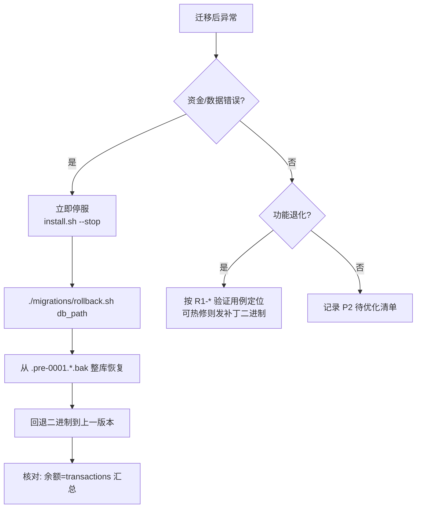

# 第五部分：风险清单与回滚方案

风险编号 `R<等级序号>`；每项含**触发条件 → 影响 → 检测手段 → 回滚/缓解**。
"一条命令回滚"统一为 `./migrations/rollback.sh <db_path>`（自动挑选最新 `.pre-0001.*.bak`）。

## P0（数据丢失 / 资金错误 / 服务中断）—— 必须附回滚方案

| 编号 | 风险 | 触发条件 | 影响 | 检测手段 | 回滚方案 |
|---|---|---|---|---|---|
| **R0-1** | **幂等键迁移前后不一致导致重复入账** | 旧代码用 `transactions.ref = recharge_orders.order_no` 去重（见 `schema.sql:177` 注释"外部订单号，充值幂等去重"）；新 orders 回填为 `ref = 'order:' ‖ order_no`（`0001_billing_orders.up.sql:58`）。若新面板的支付回调路径生成的 ref 与历史不一致，则同一笔网关回调可**二次入账** | 用户余额虚增（资金损失） | `verify.sql` **检查项 10**（幂等键前缀）逐行断言 `ref == 'order:' ‖ order_no`；上线前用回放脚本对 100 笔历史订单模拟重复回调，断言 `accounts.balance_minor` 不变 | ①`./migrations/rollback.sh <db>` 从备份整库恢复；②若已产生多余入账，用 `eyves-cli ledger reverse --ref <ref>` 冲正（生成反向分录，不删原始流水） |
| **R0-2** | **`recharge_orders.txid`（对账凭据）丢失** | 初版 `0001_billing_orders.up.sql:48-60` 的 SELECT 列表**不含** `txid`（旧表 `schema.sql:191` 的 USDT 交易号/第三方流水号），迁移后无对账凭据 | 历史 USDT / epay 流水无法与链上或网关对账；用户投诉时无法举证 | `verify.sql` **检查项 9**（对账凭据 txid）断言两边非空计数相等；迁移前可先跑取证 SQL（见下） | ✅ **已修复**：`orders` 新增 `external_txid` 列并回填 `o.txid`；若仍判 FAIL → `./migrations/rollback.sh <db>` 整库恢复后排查 |
| **R0-3** | 迁移过程有并发写入 → 备份点与终态不一致 | 迁移期间用户仍在充值/下单；`migrate-up.sh:32` 的 `cp` 不做一致性快照，WAL 未 checkpoint 时拷到的可能是撕裂副本 | 备份不可用 → 回滚后丢数据 | 迁移前断言 `PRAGMA journal_mode` 与 `-wal` 文件状态；`verify.sql` 检查项 1 行数不符即报警 | 迁移必须**停机窗口**执行（SOP 见 [04-migration.md 4.4](file:///workspace/eyves-vm/docs/04-migration.md)）：停服 → `PRAGMA wal_checkpoint(TRUNCATE)` → `cp` → 迁移；若已撕裂，从最近一次冷备恢复（`rollback.sh <db> <cold_backup>`） |
| **R0-4** | 账本与余额物化表不一致（双写偏移） | `Ledger.Apply` 实现若未把"改 accounts + 写 ledger_entries"放进同一事务 | 余额与流水永久失配，月底对账炸雷 | `verify.sql` 检查项 4 做守恒断言（当前口径：`SUM(transactions.amount_cents) == users.balance_cents`）；账本化后改用 `eyves-cli verify-balance` | 下发反向分录补齐差额（append-only，不 UPDATE 历史）；账本实现未上线前不启用 `Ledger` 的真实适配器（当前 `internal/store` 适配器尚未实现，见自审第 5 条） |
| **R0-5** | 被控端协议变更导致存量 agent 失联 | agentapi 改动破坏 `shared/proto.go` 的签名/路径/必填字段语义 | 全部节点离线，无法管理任何实例 | 灰度：先升面板（`/v1` 契约不变，只新增可选字段）→ 再滚动升 agent；每节点升级后跑 `eyves-cli node check --id N` | 面板支持"协议版本协商 + 双解码"：识别老 agent 时回退旧字段集；已升 agent 用 `deploy/update-binaries.sh --rollback` 回退二进制 |
| **R0-6** | 计费路径引入后旧 `/api/*` 充值接口被替换 | 若直接改旧 handler 而非新增 `/v2` 路由 | 已对接的第三方（epay 回调地址、WHMCS）立即 404 | 上线前跑兼容性回归：对旧路径发 1 次真实回调，断言 200 且余额变化正确 | 保留旧 handler 直到明确下线窗口（本次重构只新增，不改旧路径）；异常时 `git revert` 单次提交并重发二进制 |
| **R0-7** | **迁移脚本误报"校验通过"**（已修复，属过程风险） | 初版 `migrate-up.sh:61` 写作 `if ! sqlite3 < verify.sql \| grep -q FAIL`；在 `set -o pipefail` 下，`verify.sql` 自身报错（语法/缺列）会让管道返回非 0，`!` 反将其判为**校验通过**，进而放行一个未校验的库 | 未校验即上线，等价于 R0-1~R0-4 全部失去防线 | 回归用例：`sqlite3 db "ALTER TABLE users DROP COLUMN balance_cents"` 后跑迁移，**必须** exit 5 | ✅ **已修复**：改为捕获 `VERIFY_RC` 与输出文本双重判定（rc≠0 或含 FAIL 均 exit 5）；已实测失败路径 exit_code=5 |

### R0-2 取证 SQL（迁移**前**建议执行，迁移后由 `verify.sql` 检查项 9 自动断言）

```sql
-- 输出 rows_at_risk 供人工核对；迁移后该值必须等于 orders.external_txid 非空计数。
SELECT 'R0-2 txid_at_risk' AS check_name,
       (SELECT COUNT(*) FROM recharge_orders WHERE txid <> '') AS rows_at_risk;
```

## P1（功能退化）—— 必须附验证用例

| 编号 | 风险 | 影响 | 验证用例（必须通过） |
|---|---|---|---|
| R1-1 | 旧 `plans.price_cents` 是**单周期单币种**（`schema.sql:88`），新 `catalog.Plan.Prices` 是多周期多币种 → 年付/季付折扣无数据来源 | 年付只能按 12×月付计，无法做折扣 | `T-P1-1`：迁移后随机抽 20 个 plan，断言 `catalog.PriceOf(plan, monthly, CNY).AmountMinor == plans.price_cents`；年付价格按策略计算后再断言 |
| R1-2 | 旧 `codes`（兑换码）表与 `instances.code_id` 无对应新模型 | 兑换码业务在重构期间不可用 | `T-P1-2`：兑换码核销 → 生成 `Kind=purchase, amount=0` 订单并下发；断言实例创建成功且余额不变 |
| R1-3 | 旧 `instances.status` 是自由字符串写入（S10-3），新 `instance.State` 是闭集 → 非法旧值会被拒 | 部分实例状态无法映射，列表显示异常 | `T-P1-3`：对旧库 `SELECT DISTINCT status FROM instances` 的每个值，断言存在映射函数 `legacyStateToState()` 且无 panic；未知值落到 `error` 并记 WARN |
| R1-4 | 旧后台任务周期硬编码 2m/5m/1h（S4-7），改配置后运维沿用旧值 | 流量计量延迟变大 | `T-P1-4`：`config.example.yaml` 不含 `traffic_meter_interval` 时断言取默认 5m；含 `EYVES_BILLING_METER_INTERVAL=1m` 时断言生效 |
| R1-5 | 旧实例 `v6_addr` / `nat_addr` 为**单地址字段**（`schema.sql:125`、`:129`），新 `instance_nics` 为多网卡 | 迁移期地址归属可能丢失或错挂网卡 | `T-P1-5`：断言 `COUNT(instances WHERE v6_addr<>'') == COUNT(ipv6_addresses WHERE nic_ordinal=0)`，且逐条地址字符串相等 |
| R1-6 | 按钮/接口的 JSON 字段名变化 → 旧前端 JS 报错 | 用户端页面白屏 | `T-P1-6`：用旧版 `app.js` 对新 `/v2` 响应做契约测试；旧路径 `/app/*` 响应体字节级不变（快照测试） |
| R1-7 | `AllowedFeatures` 由导出可变 map 改为访问器（S7-1） | 若仍有代码写该 map，编译失败 | `T-P1-7`：`go build ./...` 无 `undefined: AllowedFeatures` 之外的写操作；新增单测断言修改返回的副本不影响内部白名单 |

## P2（体验/可维护性）—— 记录待优化

| 编号 | 风险 | 记录 |
|---|---|---|
| R2-1 | 迁移窗口内前端仍显示旧余额（缓存） | 迁移后强制刷新会话余额缓存；`/v2` 余额接口增加 `Cache-Control: no-store` |
| R2-2 | 新错误码 `EYVES-XXX` 对用户可见但无文案映射 | 在 `i18n.go` 补全 `eyves.err.<code>` 词条，缺词条时回退通用文案 |
| R2-3 | 迁移脚本仅覆盖 SQLite 分支 | PG/MySQL 的 up/down 尚未编写（架构已预留 `rebind`）；单机阶段不阻塞 |
| R2-4 | `0001` 的 down 丢数据且靠 `rollback.sh` 守卫 | 建议 down.sql 增加 `orders` 归档到 `orders_archive` 再 drop |
| R2-5 | 快照配额、迁移、救援模式接口未实现 | 已在 OpenAPI 中声明，实现排期见架构 2.3.3/2.6.3 |

## 回滚决策树



## 待修复项（门禁状态）

| ID | 内容 | 归属 | 门禁 | 状态 |
|---|---|---|---|---|
| F-1 | 迁移 `0001` 增加 `orders.external_txid` 列并回填 `recharge_orders.txid` | migrations | R0-2 的检查项 9 PASS | ✅ **已修复并实测** |
| F-2 | 固化幂等键格式为单一常量（`'order:' + orderNo`），面板与迁移脚本共用 | billing + migrations | R0-1 的检查项 10 PASS | ⚠️ **SQL 侧已固化并实测**；Go 侧抽 `billing.OrderRef()` 仍待做（阻塞于 F-3） |
| F-3 | 实现 `Ledger` / `OrderRepo` 的 SQLite 适配器（当前仅端口与内存 fake） | internal/store | R0-4 的 `verify-balance` 可执行 | ❌ 待开发 |
| F-4 | 迁移前 WAL checkpoint + 停机窗口 SOP 写入运维文档 | deploy | R0-3 演练通过 | ✅ 已写入 [04-migration.md 4.4](file:///workspace/eyves-vm/docs/04-migration.md) |
| F-5 | `migrate-up.sh` 校验判定改为 rc + 文本双重判定 | migrations | R0-7 回归用例 exit 5 | ✅ **已修复并实测（exit_code=5）** |